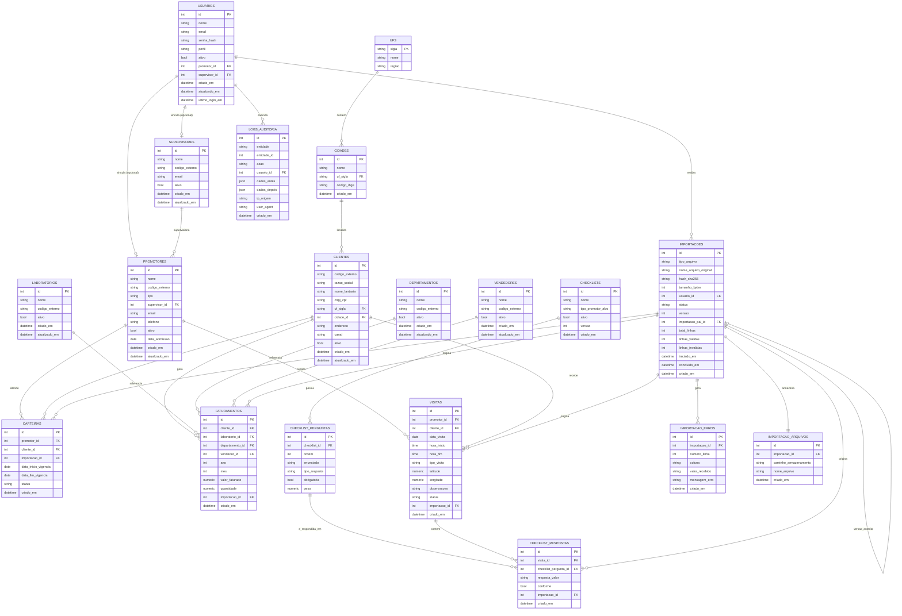

# DER.md — Diagrama Entidade-Relacionamento

## 1. Finalidade

Este documento apresenta o Diagrama Entidade-Relacionamento (DER) completo do Promotores BI, em notação Mermaid (`erDiagram`), compatível com renderização nativa no GitHub. A definição conceitual de cada entidade está em `MODELAGEM.md`; a definição física (colunas, tipos, restrições) está em `DICIONARIO_DE_DADOS.md`.

## 2. Diagrama Completo

## 3. Notas de Leitura do Diagrama

1. Relacionamentos marcados como `o|` ou `o{` no lado "muitos" representam cardinalidade **opcional** (0 ou N); `||` representa cardinalidade **obrigatória** (exatamente 1).
2. O autorrelacionamento `IMPORTACOES ||--o| IMPORTACOES` representa o vínculo `importacao_pai_id`, que conecta uma importação à versão imediatamente anterior do mesmo arquivo lógico (mesmo `tipo_arquivo`), formando uma cadeia de versões.
3. As dimensões geográficas (`UFS`, `CIDADES`) são normalizadas para suportar os filtros de UF e Cidade descritos em `DASHBOARD.md` com integridade referencial, evitando divergência de grafia entre importações.
4. O diagrama reflete exatamente as 19 tabelas físicas descritas em `DICIONARIO_DE_DADOS.md` — nenhuma tabela adicional deve ser criada na implementação sem atualização correspondente deste diagrama.
