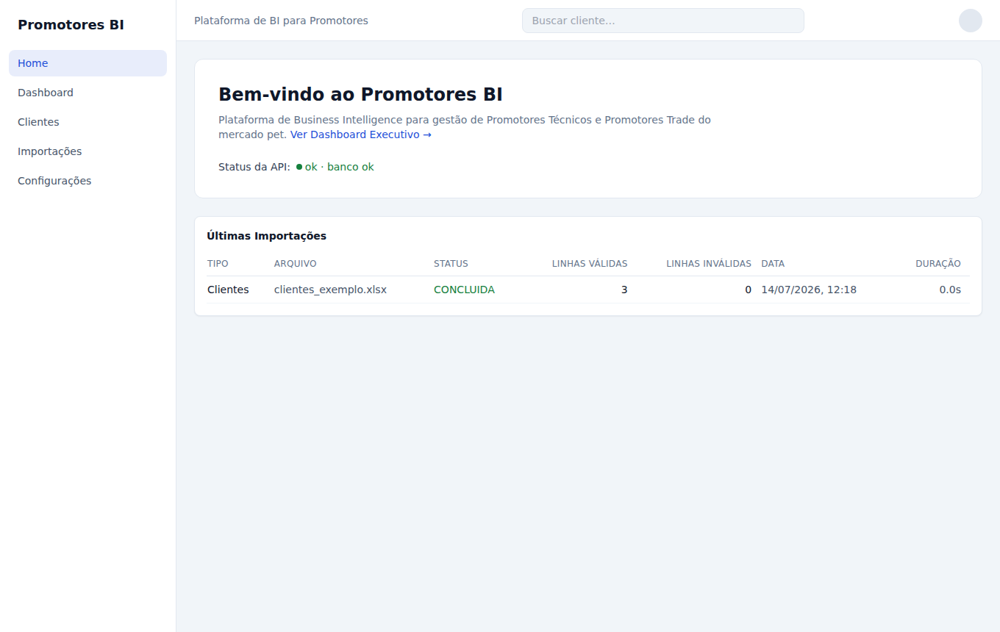
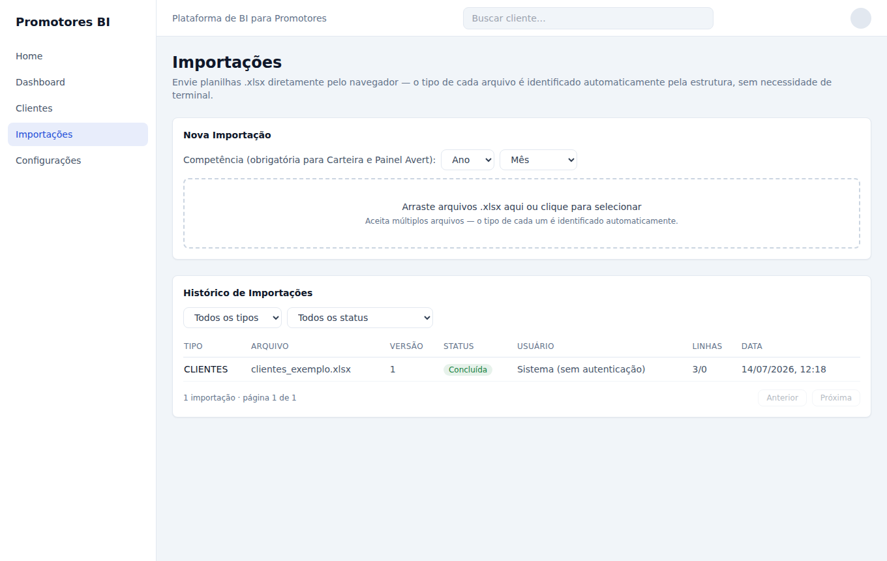
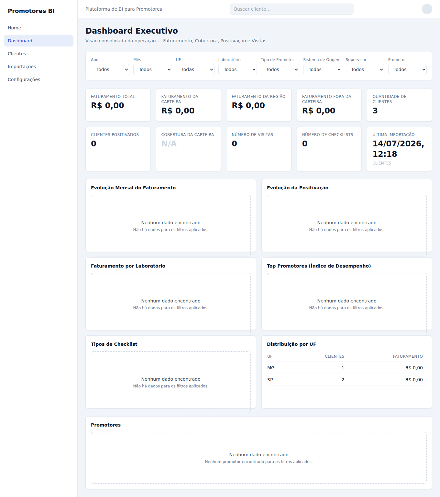

# PRIMEIRO_USO.md — Guia de Primeiro Uso do Promotores BI

Este guia foi escrito para quem **nunca programou** e precisa apenas colocar o sistema para funcionar no próprio computador, importar algumas planilhas e ver o Dashboard. Não é necessário entender nada de código — siga os passos na ordem.

Se alguma etapa não funcionar exatamente como descrito aqui, veja a seção **"Problemas comuns"** no final deste documento.

---

## Pré-requisitos

Antes de começar, você precisa de:

1. **Um computador** com Windows, Mac ou Linux, com pelo menos 4 GB de memória livre e alguns gigabytes de espaço em disco.
2. **Conexão com a internet** — necessária apenas na primeira vez, para baixar os programas.
3. **Docker Desktop instalado.** O Docker é o único programa que você precisa instalar manualmente — ele empacota todo o sistema (site + banco de dados) e faz tudo funcionar da mesma forma em qualquer computador, sem você precisar instalar Python, Node.js ou configurar nada à parte.
4. **A pasta deste projeto** já salva em algum lugar do seu computador (por exemplo, `Documentos/bi-demanda`). Se você recebeu um link do GitHub, baixe o projeto usando o botão verde **"Code" → "Download ZIP"** e depois descompacte a pasta.

Não é necessário conhecimento de programação, terminal ou linha de comando além de copiar e colar dois comandos — este guia mostra exatamente onde e como.

> Se o Docker não instalar ou não funcionar no seu computador, existe uma alternativa sem ele — veja a seção **"Alternativa: não consigo instalar ou rodar o Docker"**, mais abaixo neste guia.

---

## Instalação

### Passo 1 — Instalar o Docker Desktop

1. Acesse **https://www.docker.com/products/docker-desktop/** e baixe a versão para o seu sistema operacional (Windows, Mac ou Linux).
2. Execute o instalador e siga as instruções na tela, como qualquer outro programa (Word, Zoom, etc.). Aceite as opções padrão.
3. Quando a instalação terminar, o computador pode pedir para reiniciar. Se pedir, reinicie.
4. Abra o **Docker Desktop** (procure o ícone da baleia 🐳 no menu Iniciar/Aplicativos). Na primeira vez, ele pode pedir para criar uma conta gratuita — isso é opcional para uso local; você pode pular essa etapa ("Skip" / "Continuar sem conta") se preferir.
5. Espere o ícone da baleia, no canto da tela (barra de tarefas do Windows ou barra de menus do Mac), parar de "piscar"/animar. Quando ele fica parado, o Docker está pronto para uso.

### Passo 2 — Confirmar que o Docker está funcionando

1. Abra o **Terminal**:
   - **Windows:** clique em Iniciar, digite `PowerShell` e pressione Enter.
   - **Mac:** pressione `Cmd + Espaço`, digite `Terminal` e pressione Enter.
   - **Linux:** abra o aplicativo "Terminal" do seu sistema.
2. Digite o comando abaixo e pressione Enter:
   ```
   docker --version
   ```
3. Se aparecer uma linha com um número de versão (por exemplo `Docker version 27.0.0`), está tudo certo. Se aparecer uma mensagem de erro dizendo que o comando não existe, reabra o Docker Desktop e espere terminar de carregar, ou reinicie o computador.

Instalação concluída — você só precisa fazer isso **uma vez**.

---

## Como iniciar

1. No mesmo Terminal, entre na pasta do projeto. Digite `cd ` (com um espaço depois) e, em seguida, **arraste a pasta do projeto** (a pasta `bi-demanda`) para dentro da janela do Terminal — o caminho é preenchido automaticamente. Pressione Enter. Exemplo do que a linha deve ficar parecida:
   ```
   cd /Users/seunome/Documentos/bi-demanda
   ```
2. Digite o comando abaixo e pressione Enter:
   ```
   ./iniciar.sh
   ```
   *(Usuários de Windows sem o Terminal do Docker/WSL: use o comando alternativo `docker compose up --build` no lugar de `./iniciar.sh` — faz exatamente a mesma coisa.)*
3. Vai aparecer bastante texto passando na tela — isso é normal, é o sistema sendo preparado. **Na primeira vez isso pode levar de 3 a 10 minutos**, dependendo da velocidade da internet e do computador (as próximas vezes serão muito mais rápidas, geralmente menos de 1 minuto).
4. Quando terminar, você verá uma mensagem parecida com esta:
   ```
   ✔ Promotores BI está no ar!

     Acesse no navegador: http://localhost:5173
   ```
   Isso significa que o backend, o frontend e o banco de dados já estão rodando no seu computador.

Se preferir não usar o comando pronto, o equivalente manual é `docker compose up --build` (e `docker compose down` para encerrar) — o resultado é o mesmo.

---

## Como acessar no navegador

1. Abra seu navegador preferido (Chrome, Edge, Firefox ou Safari).
2. Digite na barra de endereço: **http://localhost:5173** e pressione Enter.
3. A tela inicial do Promotores BI deve aparecer, parecida com esta:

   

   O texto **"Status da API: ok · banco ok"** confirma que o backend e o banco de dados estão funcionando corretamente.

O menu do lado esquerdo dá acesso a todas as telas: **Home**, **Dashboard**, **Clientes**, **Importações** e **Configurações**.

---

## Como importar os arquivos

O sistema recebe planilhas `.xlsx` exportadas dos seus sistemas de origem (base de clientes, carteira de promotores, faturamento, checklists, visitas, etc.). **Você não precisa dizer qual é o tipo de cada arquivo** — o sistema identifica automaticamente pela estrutura da planilha.

1. No menu à esquerda, clique em **"Importações"**.
2. Arraste um ou mais arquivos `.xlsx` para dentro da área tracejada ("Arraste arquivos .xlsx aqui ou clique para selecionar"), ou clique nela para escolher os arquivos pelo seletor do seu computador. É possível selecionar **vários arquivos de uma vez**.
3. Se algum dos arquivos for do tipo **Carteira** ou **Painel Avert**, selecione também o **Ano** e o **Mês** de competência logo acima da área de upload, antes de arrastar o arquivo — os demais tipos não exigem essa informação.
4. Acompanhe a barra de progresso de cada arquivo. Quando terminar, o resultado aparece logo abaixo, e também na tabela **"Histórico de Importações"**:

   

5. O que cada status significa:
   - **Concluída** (verde) — todas as linhas do arquivo foram importadas com sucesso.
   - **Concluída com erros** (amarelo) — parte das linhas foi importada; algumas foram rejeitadas (ex.: um código de UF inválido). Clique na linha da importação para ver o detalhe e baixar um relatório `.csv` com a lista de erros.
   - **Falhou** (vermelho) — nenhuma linha foi importada. Motivos comuns: o arquivo já tinha sido importado antes (duplicado) ou a estrutura da planilha não foi reconhecida. Clique na linha para ver o motivo exato.
6. Clique em qualquer linha do histórico para abrir os detalhes daquela importação: quem importou, quando, quantas linhas válidas/rejeitadas, e a opção de reprocessar o mesmo arquivo, se necessário.

Repita esse processo para cada planilha que precisar importar. Não é necessário usar terminal em nenhum momento deste passo.

---

## Como visualizar o Dashboard

1. No menu à esquerda, clique em **"Dashboard"**.
2. A tela mostra uma visão consolidada com indicadores (Faturamento, Cobertura, Positivação, Visitas, Checklists), gráficos de evolução mensal e uma tabela de promotores:

   

3. Use os filtros no topo da tela (Ano, Mês, UF, Laboratório, Supervisor, Promotor, etc.) para refinar a visão — os números e gráficos são recalculados automaticamente.
4. Clique no nome de um promotor na tabela para ver o **Dashboard individual** daquele promotor.
5. Para pesquisar um cliente específico, use o campo **"Buscar cliente..."** no topo de qualquer tela, ou acesse o menu **"Clientes"**.

O Dashboard é atualizado automaticamente assim que uma nova importação é concluída — não é preciso fazer nada além de importar o arquivo.

---

## Como encerrar a aplicação

Quando terminar de usar o sistema:

1. Volte ao Terminal (a mesma janela onde você rodou `./iniciar.sh`, ou abra uma nova na pasta do projeto).
2. Digite o comando abaixo e pressione Enter:
   ```
   ./parar.sh
   ```
   *(equivalente manual: `docker compose down`)*
3. Pronto — a aplicação é encerrada. **Nenhum dado é apagado**: tudo o que foi importado continua salvo nas pastas `database/` e `imports/`, dentro da pasta do projeto, e estará lá na próxima vez que você rodar `./iniciar.sh`.

Você também pode simplesmente fechar o Docker Desktop, mas rodar `./parar.sh` primeiro é a forma mais organizada de encerrar.

---

## Alternativa: não consigo instalar ou rodar o Docker

Se o Docker Desktop não instala ou não abre no seu computador (comum em computadores mais antigos, ou corporativos com restrições), existe um **segundo caminho, sem Docker** — instalando dois programas mais simples e comuns (Python e Node.js) no lugar dele. O restante do guia (acessar no navegador, importar arquivos, ver o Dashboard) é **exatamente igual**, só o comando de iniciar/encerrar muda.

### Passo 1 — Instalar o Python

1. Acesse **https://www.python.org/downloads/** e baixe a versão **3.12**.
2. Execute o instalador. **No Windows, na primeira tela, marque a caixinha "Add python.exe to PATH"** antes de clicar em instalar — esquecer isso é o erro mais comum.
3. Siga o restante da instalação normalmente.

### Passo 2 — Instalar o Node.js

1. Acesse **https://nodejs.org/** e baixe a versão marcada como **"LTS"** (recomendada).
2. Execute o instalador e aceite as opções padrão.

### Passo 3 — Confirmar as instalações

Abra o Terminal (veja como em "Instalação", Passo 2, acima) e rode, um de cada vez:
```
python3 --version
node --version
```
Cada comando deve mostrar um número de versão. Se algum der erro, feche e reabra o Terminal (ou reinicie o computador) e tente de novo.

### Passo 4 — Iniciar (sem Docker)

Entre na pasta do projeto (mesmo truque de arrastar a pasta descrito em "Como iniciar", acima) e rode:
```
./iniciar-sem-docker.sh
```
Funciona como o `./iniciar.sh`, mas sem precisar do Docker. Na primeira vez também demora alguns minutos (baixa e instala as dependências do projeto); nas vezes seguintes é bem mais rápido. Quando terminar, aparece a mesma mensagem de sucesso com o endereço **http://localhost:5173**.

### Como encerrar (sem Docker)

```
./parar-sem-docker.sh
```

A partir daqui, siga normalmente as seções **"Como acessar no navegador"**, **"Como importar os arquivos"** e **"Como visualizar o Dashboard"** deste guia — são idênticas, independente de qual dos dois caminhos você usou para iniciar.

---

## Problemas comuns

**"./iniciar.sh: Permission denied" (ou o mesmo erro com `iniciar-sem-docker.sh`)**
Rode uma única vez o comando `chmod +x iniciar.sh parar.sh iniciar-sem-docker.sh parar-sem-docker.sh` dentro da pasta do projeto, e tente de novo.

**"Cannot connect to the Docker daemon" ou "docker: command not found"**
O Docker Desktop não está aberto (ou não terminou de carregar). Abra o Docker Desktop, espere o ícone da baleia parar de animar e rode `./iniciar.sh` novamente.

**O Docker Desktop não instala, trava, ou dá "falha na instalação"**
Alguns computadores (mais antigos, ou corporativos com restrições) não conseguem instalar o Docker. Use a seção **"Alternativa: não consigo instalar ou rodar o Docker"** acima — um segundo caminho que não depende dele.

**A página não carrega em http://localhost:5173**
Espere mais alguns segundos e atualize a página — na primeira execução o sistema pode levar um pouco mais para ficar pronto. Se persistir, rode `./parar.sh` (ou `./parar-sem-docker.sh`, se você usou o caminho alternativo) e depois inicie de novo.

**Uma das portas (5173 ou 8000) já está em uso**
Feche outros programas que possam estar usando essas portas (outro servidor local, por exemplo) e inicie de novo. Reiniciar o computador também resolve.

**Onde ficam os meus dados?**
Dentro da pasta do projeto, nas subpastas `database/` (banco de dados) e `imports/` (planilhas enviadas). Nada é enviado para a internet — tudo roda localmente no seu computador.

**Quero importar um arquivo de novo tipo, ou não sei qual pasta usar**
Não é necessário escolher pasta nenhuma — basta arrastar o arquivo `.xlsx` na tela "Importações" (ver seção acima); o sistema identifica o tipo automaticamente.
